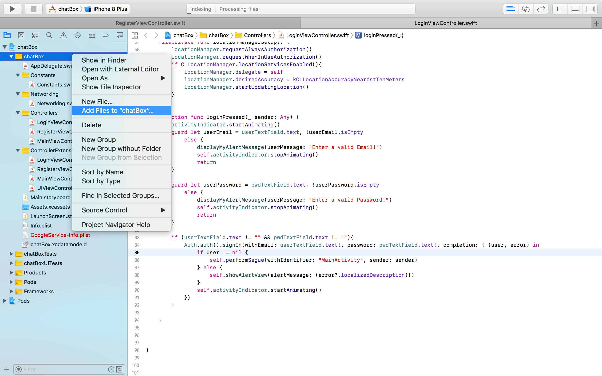

# chatBox

## Prerequisites
- IOS Running Device
- Simulator on MacOS
- Xcode 9.0 and Above
- Swift 4

## Theory
- This App is a Public ChatRoom App where Users Sign in after registering using their Email IDs and could chat with people all across Globe.
- It uses Firebase for Networking and Database Support.

## How To Run It
- Download this Project on your Mac
- Open This Project Folder
- Open the chatBox.xcworkspace
- Just Build It and Run it

#### If your project has mssing Googleservice-info.plist missing then please follow the steps in screenshots below :
- 
- 
- 
- 
- Now click on Add and Run again

